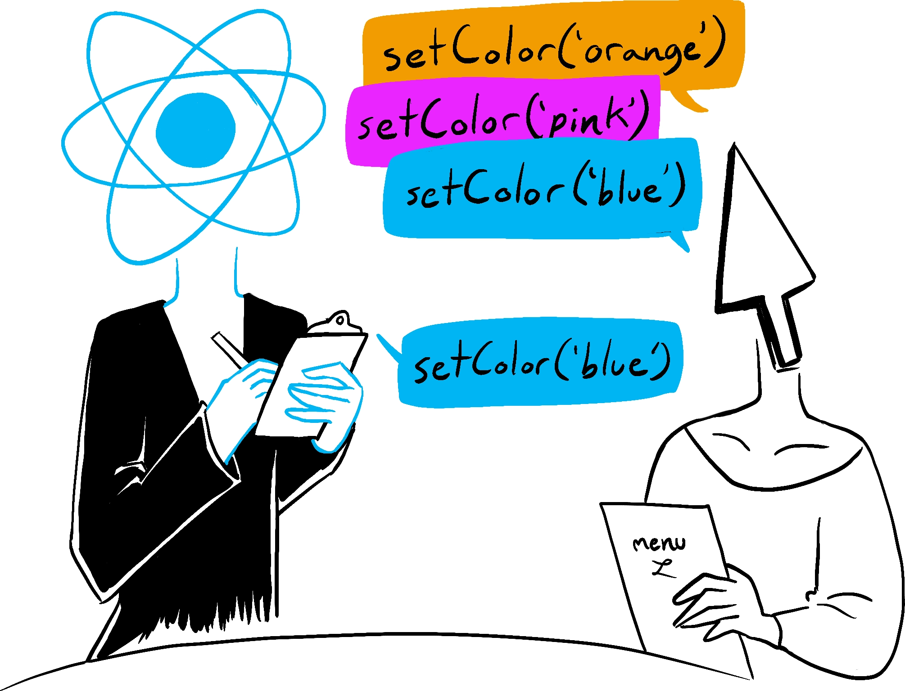

# 4장 : 재조정

# 재조정

- 리액트의 가상 돔은 우리가 **원하는 UI의 청사진**
- **재조정(Reconiliation)이라는 프로세스**를 통해 주어진 호스트 환경에서 현실로 만듦

### 내부적인 처리 방식

```tsx
const App = () => {
	const [count, setCount] = useState(0);
	
	return React.createElement(
		"main",
		null,
		React.createElement(
			"div",
			null,
			React.createElement("h1", null, "안녕하세요!"),
			React.createElement("span", null, "카운트 : ", count),
			React.createElement(
				"button",
				{ onClick: () => setCount(count + 1) },
				"증가"
			)
		)
	)
}
```

- JSX는 React Element의 트리가 됨
    - JSX의 `<` 기호 또는 `createElement`를 통해 리액트 엘리먼트 반환
        - 이는 우리가 그리고자 하는 UI 상태 표현 (선언적)

```tsx
{
  type: "main",
  props: {
    children: {
      type: "div",
      props: {
        children: [
          {
            type: "h1",
            props: {
              children: "안녕하세요!"
            }
          },
          {
            type: "span",
            props: {
              children: ["카운트 : ", count]
            }
          },
          {
            type: "button",
            props: {
              onClick: () => setCount(count + 1),
              children: "증가"
            }
          }
        ]
      }
    }
  }
}
```

- 그리고 리액트 엘리먼트의 트리를 계산하여 객체화함
    - 해당 트리를 기반으로 **최소한의 DOM API만 호출**해 브라우저에 반영

      → 어떻게 최소화할까?


# 일괄 처리

```tsx
function Example() {
	const [count, setCount] = useState(0);
	
	const handleClick = () => {
		setCount((prev) => prev + 1);
		setCount((prev) => prev + 1);
		setCount((prev) => prev + 1);
	}
	
	return (
		<div>
			<p>카운트: {count}</p>
			<button onClick={handleClick}>증가</button>
		</div>
	)
}
```

- 예시에서는 setCount가 세 번 연속 호출됨
    - 일괄 처리하지 않으면 실제로 변경되는 건 한 번으로 보이지만 실제 DOM은 세 번 업데이트 됨.

      → 성능 낭비


- 가장 효율적인 일괄 업데이트를 계산하기 위해 현재 가상 DOM 트리를 복제해 새로운 가상 DOM 트리를 생성하고 업데이트된 값을 적용함
    - 그래서 count + 1을 3번 반복하는 것이 아닌 count + 3을 1번 계산하도록 만듦
### 이 부분의 설명이 조금 부족하기에 참고용으로 작성해보자면…

- 참고 : https://react.dev/learn/state-as-a-snapshot
- 리액트는 상태를 업데이트할 때 **스냅샷처럼 기억함**
- setter 함수는 Queue를 통해 모든 이벤트 핸들러가 끝나고 상태를 업데이트함.
- 공식 사이트에선 이를 음식점의 손님과 웨이터에 비유하여 설명함.
    - 손님의 주문을 기록하면서 맨 마지막 주문만 받아들이는 원리
    - 또한 **setter는 Queue(Like Linked-list)로 연결되어 있으므로 이전 상태를 참조 가능**.
    - 위의 예시 처럼 함수의 형태로 이전의 상태를 인자로 받아 반환 값에 사용할 수 있음.

### 코드레벨을 좀 더 보자면…

```tsx
const [state, setState] = useState(0);

setState((prev) => prev + 1);
setState((prev) => prev + 3);
```

- 해당 코드가 어떻게 동작하는지 살펴보자면 다음과 같이 동작함

```tsx
const update: Update<S, A> = {
   lane,
   revertLane: NoLane,
   action, // (prev) => prev + 1
   hasEagerState: true,
   eagerState: 1,
   next: {
     lane,
     revertLane: NoLane,
     action, // (prev) => prev + 3
     hasEagerState: true,
     eagerState: 4,
     next : null, // set 함수가 추가된다면 이 곳에 값이 들어갑니다.
   },
}
...
 try {
    const currentState: S = 0;
    const eagerState = lastRenderedReducer(currentState, action);
    update.hasEagerState = true;
    update.eagerState = eagerState;
  }
...
```

- update 객체 내에서 훅들이 연결되어 있음
    - 여기서 훅은 반드시 최상위에서 선언되어야 한다는 규칙이 생긴 이유를 알아볼 수 있음
        - 이를 어긴다면 컴포넌트가 렌더링될 때마다 hook의 실행 순서를 보장할 수 없음

# 기존 재조정 기술 (Stack)

- 리액트 16 미만에서 사용
- 실제 자료구조와 같은 스택의 원리를 차용 (LIFO, Last In First Out)
    - 마지막으로 추가된 원소가 가장 먼저 제거
- 해당 방법으로 재조정을 할 경우, **순차적으로 변경 사항을 렌더링**
    - 만약 계산 비용이 비싼 컴포넌트가 렌더링을 막아 버리면 사용자 입력이 눈에 띄게 버벅거리며 화면에 표시됨
    - 사용자 입력의 우선순위를 높게 설정해 입력 내용을 화면에 바로 반영하고 계산 비용이 큰 컴포넌트를 뒤늦게 렌더링할 수 있다면 좀 더 나은 사용자 경험이 될 것임
        - React 18 → startTransition API?
    - 만약 우선순위가 높은 렌더링 작업이 필요할 땐 현재 진행 중인 렌더링 작업을 멈출 수 있어야 함
        - 그렇다면 특정 종류의 렌더링 연산을 다른 종류의 렌더링보다 우선시해야 함

          ⇒ 즉, **렌더링 종류마다 우선순위가 필요**해짐


## 단점

- **스택 재조정자는 업데이트의 우선순위가 없음**. 그래서 중요한 업데이트를 방해하는 현상이 일어남.
- 스택 재조정자는 업데이트가 추가된 순서대로 실행되었기 때문에 **덜 중요한 업데이트가 더 중요한 업데이트를 차단할 수도 있음**.
    - 폼 입력 업데이트 전에 좋아요 수 업데이트가 추가되었다면, 좋아요 수 업데이트가 먼저 실행되어 폼 입력 업데이트를 차단할 수 있음.
- **스택 재조정자는 업데이트를 중단하거나 취소할 수 없음**. 우선순위와 상관없이 업데이트에 들어가면 무조건 렌더링이 마무리되어야 다음 스텝으로 갈 수 있음
    - 토스트 알람 창같은 우선순위가 낮은 업데이트가 사용자 상호 작용을 방해하면서 수행되는 경우가 있었음.
        - 사용자는 입력해야 하는데 갑자기 토스트 알람 창으로 인해 버벅이면서 느려지는 사태 발생

# 파이버 재조정자 (Fiber)

- 기존 스택 기반의 단점을 극복하기 위해 만들어짐
- 조정자를 위한 작업 단위를 나타내는 `파이버(Fiber)`라는 데이터 구조가 사용됨.
    - 파이버는 React Element에서 생성
        - 파이버는 상태를 저장하고 수명이 긴 반면 엘리먼트는 임시적이고 상태가 없음

## 데이터 구조로서의 파이버

- 파이버 재조정자는 업데이트의 우선순위를 정하고 이에 따라 동시 실행을 가능케 하여 리액트의 성능과 응답성 향상
- **파이버 데이터 구조**는 리액트 내 컴포넌트 인스턴스와 그 상태를 표현
    - 변경 가능한 인스턴스로 설계
        - 조정 과정에서 필요에 따라 재배치 및 업데이트

```tsx
// 파이버 노드의 기본 구조 예시
const fiber = {
  // 인스턴스 관련
  tag: WorkTag,           // 파이버의 유형 (함수형, 클래스형 등)
  key: null | string,     // 리액트 엘리먼트의 키
  elementType: any,       // 엘리먼트의 타입 (예: 'div', MyComponent)
  type: any,              // 함수형 컴포넌트의 경우 함수 자체
  stateNode: any,         // DOM 노드 또는 컴포넌트 인스턴스

  // 파이버 트리 구조
  return: Fiber | null,   // 부모 파이버
  child: Fiber | null,    // 첫 번째 자식 파이버
  sibling: Fiber | null,  // 다음 형제 파이버
  index: number,          // 형제들 사이의 인덱스

  // 작업 관련
  pendingProps: any,      // 새로운 props
  memoizedProps: any,     // 이전에 렌더링된 props
  updateQueue: UpdateQueue | null, // 상태 업데이트 큐
  memoizedState: any,     // 이전에 렌더링된 상태
  dependencies: Dependencies | null, // 컨텍스트, 이벤트 등 의존성

  // 효과 플래그
  flags: Flags,           // 이펙트 타입 플래그
  subtreeFlags: Flags,    // 자식 파이버들의 플래그
  deletions: Array<Fiber> | null, // 삭제될 자식 파이버 목록

  // 스케줄링 관련
  lanes: Lanes,           // 우선순위 레인
  childLanes: Lanes,      // 자식 파이버들의 레인

  // 대체 파이버
  alternate: Fiber | null // 작업 중인 파이버에 대한 대체 파이버
};
```

- **tag** : 파이버의 유형 식별 (클래스는 3으로 표시함)

```tsx
// WorkTag 열거형의 주요 값들
const FunctionComponent = 0;       // 함수형 컴포넌트
const ClassComponent = 1;          // 클래스형 컴포넌트
const IndeterminateComponent = 2;  // 아직 결정되지 않은 컴포넌트 타입
const HostRoot = 3;                // 루트 파이버
const HostPortal = 4;              // 포털
const HostComponent = 5;           // DOM 요소 (div, span 등)
const HostText = 6;                // 텍스트 노드
const Fragment = 7;                // React.Fragment
const Mode = 8;                    // <React.StrictMode> 같은 모드
const ContextConsumer = 9;         // Context.Consumer
const ContextProvider = 10;        // Context.Provider
const ForwardRef = 11;             // React.forwardRef
const Profiler = 12;               // <Profiler>
const SuspenseComponent = 13;      // <Suspense>
const MemoComponent = 14;          // React.memo로 감싼 컴포넌트
const LazyComponent = 16;          // React.lazy로 감싼 컴포넌트
const Block = 22;                  // 실험적 블록 컴포넌트
```

- **type** : 파이버가 나타내는 컴포넌트
    - "무엇을 렌더링해야 하는가"를 정의합니다. 청사진 또는 템플릿 역할입니다.
    - 컴포넌트 정의 또는 HTML 태그 이름
- **props** : 컴포넌트 입력 인수(값)
- **stateNode** : App Component 인스턴스
    - "렌더링된 결과물"이 무엇인지를 참조합니다. 실제 구현체입니다.
    - 실제 DOM 노드 또는 컴포넌트 인스턴스

```tsx
<div>Hello</div>

// 이에 대한 Fiber 노드에서:
fiber.type === 'div'; // 문자열
fiber.stateNode; // 실제 HTMLDivElement DOM 노드
```

```tsx
class Counter extends React.Component {
  // ...
}

// 이에 대한 Fiber 노드에서:
fiber.type === Counter; // 클래스 생성자 함수
fiber.stateNode; // Counter의 실제 인스턴스 (this가 참조하는 객체)
```

## 파이버 재조정 액션

- 현재 파이버 트리와 다음 파이버 트리를 비교해 **어느 노드를 업데이트/추가/제거**할지 파악
- 조정 과정 중에 각 리액트 엘리먼트에 파이버 노드 생성
    - 이 업무는 `createFiberFromTypeAndProps` 라는 함수가 수행
- 파이버 노드가 생성되면 작업 루프(work loop)를 사용해 사용자 인터페이스를 업데이트
    1. beginWork : 작업 루프는 **루트 파이버 노드에서 시작해 컴포넌트 트리를 따라 내려가면서** 업데이트가 필요한 경우 각 파이버 노드를 `dirty`로 표시함
    2. completeWork : 끝에 도달하면 다시 반대로 순회하면서 브라우저 DOM 트리와는 분리된 새 DOM 트리를 메모리에 생성
    3. 새 DOM 트리는 이후 화면에 반영(flushed)

  ⇒ 이러한 과정은 사용자가 볼 수 없으므로 언제든지 중단하고 버릴 수 있음

- **‘더블 버퍼링’ 개념을 착안**해서 파이버 아키텍처 형성

### 더블 버퍼링


- 두 개의 버퍼를 활용해 업데이트 과정을 거침 (컴퓨터 그래픽스)
    - 첫 번째 버퍼에 첫 번째 프레임을 채움
    - 첫 번째 버퍼가 표시되는 동안 두 번째 버퍼가 새 데이터로 업데이트
    - 두 번째 버퍼가 준비되면 첫 번째 버퍼로 전환되어 화면에 표시
    - 첫 번째 버퍼와 두 번째 버퍼가 일정한 간격으로 전환되어 프로세스 계속 진행
    - Write는 Write할 때만, Read는 Read할 때만 사용하도록 목적성 분리

  

- TMI) 이 방법의 문제점 : **image tearing**
    - Front Buffer에서 출력하는 동안 Back Buffer와 Swap되면 이미지가 찢어지는 현상 발생
- 더블 버퍼링 방법을 사용하면 이미지나 동영상이 중단이나 지연 없이 표시되므로 플리커 현상이 줄어듬

# 파이버 재조정 ?== 더블 버퍼링


- **렌더링** : 업데이트가 발생하면 현재 파이버 트리가 fork되어 주어진 사용자 인터페이스의 새로운 상태를 반영하도록 업데이트(workInProgress Tree)
- **커밋** : 현재 트리를 대체할 트리가 준비되고 사용자가 기대하는 상태를 정확하게 반영하면, 더블 버퍼링에서 버퍼를 교체하는 것처럼 현재 파이버 트리(current Tree)와 교체

### 장점

- 실제 DOM에 대한 불필요한 업데이트를 피할 수 있어 성능 개선 + 플리커 현상 줄어들게 가능
- 화면 밖에서 UI의 새 상태를 계산하고 우선순위가 더 높은 새로운 업데이트가 필요한 경우 버릴 수 있음
- 재조정은 화면 밖에서 이루어지므로 사용자가 현재 보고 있는 내용을 망치지 않고 일시 중지했다가 다시 시작할 수도 있음

⇒ 가장 중요한 점은 렌더링 중단이 가능해짐

- 렌더링이 중단 가능한 듯 보이는 이유는 **리액트 스케줄러가 5ms마다 실행을 메인 스레드로 돌려주기 때문**
- 이로 인해 렌더링을 하다가 계속 더 우선순위가 높은 작업이 있는지 체크를 하게 됨
    - 우선순위에 따라 렌더링을 나눌 수 있음!!

## 렌더링 단계


- 현재 트리에서 상태 변경 이벤트가 발생하면 시작

### beginWork(작업 시작)

- 파이버 노드의 업데이트 필요 여부를 나타내는 플래그를 설정
- 루트 노드에서 리프 노드로 DFS 방식으로 하향
- 해당 작업이 완료되면 completeWork를 호출하고 다시 거슬러 올라가며 순회

```tsx
function beginWork(
    current: Fiber | null,
    workInProgress : Fiber,
    renderLanes : Lanes
): Fiber | null;
```

- **current** : 현재 트리의 파이버 노드에 대한 참조
    - 트리의 이전 버전과 새 버전 간에 변경된 사항과 업데이트할 사항을 결정하는 데 사용
    - 불변값, 비교용으로 사용
- **workInProgress** : 작업용 트리에서 업데이트 중인 파이버 노드
    - `beginWork`으로 인해 업데이트되며 `dirty`로 표시된채 반환되는 노드
- **renderLanes** : 업데이트가 처리되는 `Lanes`을 나타내는 `Bitmask`
    1. **선택적 렌더링**:
        - 모든 컴포넌트를 항상 재렌더링하는 대신, React는 `renderLanes`와 각 Fiber의 `lanes`를 비교하여 현재 렌더링 패스에서 업데이트해야 할 컴포넌트만 선택적으로 처리
    2. **우선순위 기반 스킵**:
        - 낮은 우선순위의 업데이트는 높은 우선순위 작업이 처리되는 동안 일시적으로 건너뛸 수 있습니다.
        - 이후 별도의 렌더링 패스에서 처리됩니다.
        - 사용자 상호 작용이나 접근성에 영향을 미치는 업데이트 등 우선순위가 높은 업데이트가 최우선으로 처리 가능
            1. 타이핑 이벤트는 높은 우선순위 레인에 할당
            2. 데이터 로딩 업데이트는 낮은 우선순위 레인에 할당
    3. **최적화(Early Bailout)**:
        - 컴포넌트와 그 자식들이 현재 처리 중인 우선순위의 업데이트가 없다면, React는 해당 서브트리의 작업을 생략할 수 있습니다.
        - 이는 `React.memo`, `shouldComponentUpdate`, `PureComponent` 등의 최적화를 내부적으로 지원합니다

### Lane이란 뭘까

- 이전엔 React에선 “Expiration Time" 기반 접근 방식(시간 기반 우선순위)을 사용했으나 이를 비트 기반으로 대체함
- 각 Lane은 특정 우선순위 수준을 나타내는 비트 플래그. 32비트 정수를 사용하므로 React는 최대 31개의 서로 다른 우선순위 레벨을 표현할 수 있습니다 (하나는 NoLanes용).
- 일단 AND, OR 연산이 가능해서 뭐가 포함되어 있는지에 따라 쉽게 우선순위 체크가 가능
- 32가지의 boolean값 저장보단 하나의 32비트 정수만 사용하면 되므로 효율적

```tsx
// 레인이 없음
export const NoLanes = /*                        */ 0b0000000000000000000000000000000;
export const NoLane = /*                         */ 0b0000000000000000000000000000000;

// 동기 작업을 위한 가장 높은 우선순위
export const SyncLane = /*                       */ 0b0000000000000000000000000000001;

// 연속적인 사용자 입력(키 입력, 클릭 등)
export const InputContinuousLane = /*            */ 0b0000000000000000000000000000010;

// 일반적인 업데이트
export const DefaultLane = /*                    */ 0b0000000000000000000000000000100;

// 트랜지션(전환) 업데이트
export const TransitionLane1 = /*                */ 0b0000000000000000000000000001000;
export const TransitionLane2 = /*                */ 0b0000000000000000000000000010000;
// ... 더 많은 트랜지션 레인

// 낮은 우선순위 작업
export const IdleLane = /*                       */ 0b0100000000000000000000000000000;

// 오프스크린 작업
export const OffscreenLane = /*                  */ 0b1000000000000000000000000000000;
```

### completeWork(작업 완료)

- 파이버 노드에 업데이트를 적용하고 애플리케이션의 업데이트된 상태를 나타내는 실제 DOM 트리를 새롭게 생성
    - DOM에서 분리된 트리를 브라우저가 시각적으로 표현하는 영역 바깥에 구성 (언제든지 중단 가능)
        - `document.createElement` 등으로 열심히 DOM Tree를 그리겠지만 언제든지 버려질 수 있음
- 리프 노드에서 루트 노드로 상향식
    - 루트 노드에 도달하면 **렌더링 단계가 완료**됨
- 여기서 `useEffect` 와 같은 사이드-이펙트 처리
    - 커밋 단계에서 실행할 이펙트 구성

## 커밋 단계

- 렌더링 단계에서 가상 DOM에 적용된 변경 사항을 실제 DOM에 반영함
- 새 가상 DOM 트리가 호스트 환경에 커밋되고 작업용 트리가 현재 트리로 바뀜

### 변형 단계

- 가상 DOM에 적용된 변경 사항을 실제 DOM에 반영
    - 적용할 업데이트 식별
    - `commitMutationEffects` 라는 특수 함수 호출
        - 렌더링 단계에서 파이버 노드에 적용된 업데이트를 실제 DOM에 반영

### 레이아웃 단계

- 업데이트된 노드의 새 레이아웃을 계산
    - `commitLayoutEffects`라는 특수 함수 호출
- 레이아웃 단계가 완료되면, 렌더링 단계에서 가상 DOM에 적용되었던 변경 사항을 실제 DOM에 성공적으로 반영하게 됨

### 효과

- 커밋 단게예서는 여러 side-effect가 특정 순서로 실행됨
    - 그 순서는 효과 종류에 따라 달라짐
- **1. 지연 효과(Passive Effects)**
    - 주로 `useEffect` 훅에 의해 생성됩니다.
    - 브라우저가 화면을 그린 후 비동기적으로 실행됩니다.
    - 예: 데이터 분석, 구독 설정, 외부 API 호출, 타이머 설정
    - 특징: 렌더링 성능에 영향을 미치지 않아야 하는 작업에 적합
- **2. 레이아웃 효과(Layout Effects)**
    - 주로 `useLayoutEffect` 훅에 의해 생성됩니다.
    - DOM 변경 직후, 브라우저가 화면을 그리기 전에 동기적으로 실행됩니다.
    - 예: DOM 요소의 크기나 위치 측정, DOM 요소에 직접 접근하여 조작
    - 특징: 시각적 업데이트가 필요한 작업에 적합
- **3. 삽입/마운트 효과(Insertion/Mount Effects)**
    - 새로운 DOM 노드가 추가될 때 실행됩니다.
    - 예: 요소 마운트, 자식 컴포넌트 추가
    - 특징: DOM 구조 변경과 관련된 작업
- **4. 삭제/언마운트 효과(Deletion/Unmount Effects)**
    - DOM 노드가 제거될 때 실행됩니다.
    - 예: 요소 제거, 컴포넌트 언마운트, 정리(cleanup) 함수 호출
    - 특징: 리소스 정리와 메모리 누수 방지 관련 작업

### 효과 실행 순서

1. **먼저 삭제/언마운트 효과**가 실행됩니다.
    - 이전 렌더에서 존재했지만 이번 렌더에서는 제거된 노드들에 대한 정리
2. **그 다음 삽입/마운트 효과와 업데이트 효과**가 실행됩니다.
    - DOM 변경 적용 (노드 추가, 속성 변경 등)
3. **레이아웃 효과**가 실행됩니다.
    - DOM이 업데이트된 직후, 화면이 그려지기 전에 실행
4. **마지막으로 지연 효과**가 실행됩니다.
    - 화면이 그려진 후 비동기적으로 실행

### 배치 효과(Batched Effects)

배치 효과는 성능을 위해 여러 효과를 그룹화하여 한 번에 처리하는 기법입니다:

- 여러 상태 업데이트를 하나의 렌더링으로 묶어 처리
- 여러 useEffect 콜백을 하나의 작업으로 묶어 처리
- 이를 통해 불필요한 렌더링 사이클을 줄이고 성능을 향상

React 18에서는 자동 배치(Automatic Batching)를 도입하여 이벤트 핸들러 외부에서도 상태 업데이트를 자동으로 배치 처리

18 이전에서는 이벤트 핸들러에서만 batch update가 도입됨. 다른 핸들러 외부(setTImeout, Promise 등)에선 `unstable_batchedUpdates` API를 사용해야 하였음 ([링크](https://react.dev/blog/2022/03/29/react-v18#new-feature-automatic-batching))

```tsx
setTimeout(() => {
    setCount(c => c + 1);
    setFlag(f => !f);
    // Batching이 없어 두 번 렌더링 됨
}, 1000);
```